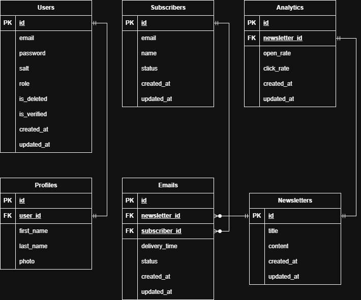

# 📰 JNews

## Table of Contents
<!-- TOC -->
* [📰 JNews](#-jnews)
  * [Table of Contents](#table-of-contents)
  * [Description](#description)
  * [🖇 Entity Relationship Diagram](#-entity-relationship-diagram)
  * [📖 JNews API Endpoints](#-jnews-api-endpoints)
    * [🔐 Authentication](#-authentication)
    * [📝 Notes](#-notes)
  * [🛠 Tools & Technologies](#-tools--technologies)
  * [📃 Project Report](#-project-report)
    * [📆 Project Management Board](#-project-management-board)
    * [👥 User Stories](#-user-stories)
      * [👑 Admin User Stories](#-admin-user-stories)
      * [📢 Campaign Manager User Stories](#-campaign-manager-user-stories)
      * [✉️ Subscriber User Stories](#-subscriber-user-stories)
    * [👩🏽‍💻 General Approach to Development](#-general-approach-to-development)
    * [💀 Major Hurdles & Challenges](#-major-hurdles--challenges)
  * [📝 Installation & Testing Instructions](#-installation--testing-instructions)
<!-- TOC -->

---

## Description

Java Spring Boot newsletter campaign management app. Get subscribers to sign up to your newsletter,
manage your newsletter publications, and e-mail them to your subscribers. Utilizes multithreading and concurrency techniques
for efficient mailing and subscriber management operations. Completely self-contained and self-hostable app, no third party
dependency management needed.

The mailing feature can be used even from local only server, however the un/subscription endpoints need to be live for organic sign-ups.
You can otherwise import a list of subscriber e-mails and message those instead.

---

## 🖇 Entity Relationship Diagram

---

## 📖 JNews API Endpoints

### 🔐 Authentication
- **Security Scheme**: Bearer Token (`Authorization: Bearer <token>`)

| Category         | Method | Endpoint                       | Description                                                         | Example Request Body / Params                                                                                  |
|------------------|--------|--------------------------------|---------------------------------------------------------------------|----------------------------------------------------------------------------------------------------------------|
| **Users**        | POST   | `/auth/users/register`         | Register new user                                                   | `{ "email": "user@example.com", "password": "123" }`                                                           |
|                  | POST   | `/auth/users/login`            | Login user                                                          | `{ "email": "user@example.com", "password": "123" }`                                                           |
|                  | DELETE | `/auth/users/{userId}`         | Soft delete user by ID. Admin only.                                 | Path param: `userId=1`                                                                                         |
|                  | POST   | `/auth/users/change-password`  | Change logged-in user’s password                                    | `{ "oldPassword": "abc", "newPassword": "xyz", "confirmNewPassword": "xyz" }`                                  |
|                  | POST   | `/auth/users/forgot-password`  | Send reset password token to verified email                         | `{ "email": "user@example.com" }`                                                                              |
|                  | POST   | `/auth/users/reset`            | Reset user’s password                                               | `{ "token": "uuid", "password": "newPass", "confirmPassword": "newPass" }`                                     |
|                  | POST   | `/auth/users/register/default` | Register system default admin. First account in new app only.       | `{ "email": "admin@example.com", "password": "@dm!nP@$$" }`                                                    |
|                  | POST   | `/auth/users/register/admin`   | Register admin user (requires logged-in admin)                      | `{ "email": "admin2@example.com", "password": "123" }`                                                         |
| **Verification** | POST   | `/auth/users/verify`           | Verify user’s email via token                                       | Query param: `token=uuid`                                                                                      |
|                  | POST   | `/auth/users/token`            | Reissue verification token                                          | Query param: `token=uuid`                                                                                      |
| **Profile**      | GET    | `/profile`                     | Get logged-in user’s profile                                        | –                                                                                                              |
|                  | POST   | `/profile`                     | Create logged-in user's profile                                     | `{ "firstName": "Ahmed", "lastName": "Ali" }`                                                                  |
|                  | PATCH  | `/profile`                     | Update logged-in user's profile                                     | `{ "firstName": "Ahmed", "lastName": "Alali" }`                                                                |
|                  | GET    | `/profile/photo`               | Download logged-in user's profile photo                             | –                                                                                                              |
|                  | POST   | `/profile/photo`               | Upload logged-in user's profile photo (PNG/JPEG)                    | FormData: `file=@photo.png`                                                                                    |
|                  | DELETE | `/profile/photo`               | Delete logged-in user's profile photo (reset to placeholder)        | –                                                                                                              |
| **Newsletters**  | GET    | `/newsletters/{id}`            | Get newsletter by ID                                                | Path param: `id=6`                                                                                             |
|                  | GET    | `/newsletters`                 | Get newsletter by title                                             | Query param: `title=Spring Update`                                                                             |
|                  | GET    | `/newsletters/list`            | Get all newsletters (async)                                         | –                                                                                                              |
|                  | GET    | `/newsletters/{id}/html`       | Download newsletter HTML body                                       | Path param: `id=6`                                                                                             |
|                  | GET    | `/newsletters/{id}/text`       | Download newsletter plain text body                                 | Path param: `id=6`                                                                                             |
|                  | POST   | `/newsletters/add`             | Create newsletter (multipart form data)                             | FormData: `title=Spring`, `subject="Studio Update"`, `body_html=@newsletter.html`, `body_text=@newsletter.txt` |
|                  | PATCH  | `/newsletters/{id}`            | Update newsletter by ID (multipart form data)                       | FormData: `title=NewTitle`, `subject="Updated Subject"`, `body_html=@updated.html`, `body_text=@updated.txt`   |
|                  | DELETE | `/newsletters/{id}`            | Hard delete newsletter (irrecoverable)                              | Path param: `id=6`                                                                                             |
| **Subscribers**  | GET    | `/subscribers/{id}`            | Get subscriber by ID                                                | Path param: `id=150`                                                                                           |
|                  | GET    | `/subscribers`                 | Get subscriber by email                                             | Query param: `email=user@example.com`                                                                          |
|                  | POST   | `/subscribers/subscribe`       | Create new subscriber. No authentication required.                  | `{ "email": "user@example.com", "name": "Optional", "status": "SUBSCRIBED" }`                                  |
|                  | PATCH  | `/subscribers/{id}`            | Update subscriber info                                              | `{ "email": "new@example.com", "name": "Updated Name" }`                                                       |
|                  | PATCH  | `/subscribers/subscribe`       | Subscribe existing unsubscribed member. No authentication required. | Query param: `email=user@example.com`                                                                          |
|                  | PATCH  | `/subscribers/unsubscribe`     | Unsubscribe existing subscribed member. No authentication required. | Query param: `email=user@example.com`                                                                          |
|                  | DELETE | `/subscribers/{id}`            | Hard delete subscriber                                              | Path param: `id=150`                                                                                           |
|                  | POST   | `/subscribers/add`             | Create subscribers from CSV/plain-text file                         | FormData: `file=@subscribers.csv`                                                                              |
|                  | GET    | `/subscribers/list`            | Get all subscribers (async)                                         | –                                                                                                              |
|                  | GET    | `/subscribers/list/{status}`   | Get subscribers filtered by status                                  | Path param: `status=SUBSCRIBED`                                                                                |
|                  | GET    | `/subscribers/export`          | Download subscribers CSV file (async)                               | –                                                                                                              |
|                  | POST   | `/subscribers/import`          | Import subscribers from CSV/plain-text file                         | FormData: `file=@subscribers.csv`                                                                              |
|                  | DELETE | `/subscribers/delete`          | Delete all subscribers (async)                                      | –                                                                                                              |
|                  | DELETE | `/subscribers/delete/{status}` | Delete subscribers by status (async)                                | Path param: `status=UNSUBSCRIBED`                                                                              |
| **Emails**       | POST   | `/emails/send`                 | Send newsletter email to subscribers filtered by status             | Query params: `newsletterId=6`, `subscriberStatus=SUBSCRIBED`                                                  |

### 📝 Notes
- All endpoints require **Bearer token authentication** unless otherwise specified.
- Use `application/json` for request bodies.
- Responses are not detailed in this spec — adapt based on your implementation.

---

## 🛠 Tools & Technologies

**Backend Layer**
- Spring Boot [(spring.io)](https://start.spring.io/) (Starter Parent, WebMVC, Data JPA, Security, Mail)
- Spring Boot DevTools (hot reload)

**Database Layer**
- [PostgreSQL](https://jdbc.postgresql.org/) (runtime driver)
- JPA/Hibernate (via Spring Data JPA)

**Security Layer**
- Spring Security
- [JJWT](https://github.com/jwtk/jjwt) (API, Impl, Jackson for JWT authentication)

**Utilities**
- [Project Lombok](https://projectlombok.org/) (boilerplate reduction)
- Spring Boot Starter WebMVC Test (unit/integration testing)

**Build & Tooling**
- Maven Compiler Plugin (Java 17, annotation processing)
- Spring Boot [Maven Plugin](https://maven.apache.org/) (packaging, running)

---

## 📃 Project Report

### 📆 Project Management Board
[GitHub Project](https://github.com/users/falansari/projects/14/views/1)

### 👥 User Stories

#### 👑 Admin User Stories
- As an **admin**, I want to **soft delete user accounts by ID**, so that I can manage system integrity without permanently losing data.
- As an **admin**, I want to **create other admin accounts**, so that I can delegate system management responsibilities.
- As an **admin**, I want to **log in securely with authentication**, so that only authorized personnel can access sensitive functionality.
- As an **admin**, I want to **have full access to all system features**, so that I can oversee and maintain the entire application.

#### 📢 Campaign Manager User Stories
- As a **campaign manager**, I want to **create, update, and delete newsletters**, so that I can manage communication content effectively.
- As a **campaign manager**, I want to **send newsletters to subscribers filtered by status**, so that I can target the right audience.
- As a **campaign manager**, I want to **manage subscribers (add, update, import, export, delete)**, so that I can maintain an accurate mailing list.
- As a **campaign manager**, I want to **subscribe or unsubscribe members by email**, so that I can respect user preferences.
- As a **campaign manager**, I want to **manage my own user profile (update name, upload/delete photo)**, so that my account reflects my identity.
- As a **campaign manager**, I want to **log in securely with authentication**, so that I can access management features safely.

#### ✉️ Subscriber User Stories
- As a **subscriber**, I want to **subscribe my email address to the mailing list**, so that I can receive newsletters.
- As a **subscriber**, I want to **unsubscribe my email address from the mailing list**, so that I can stop receiving newsletters.
- As a **subscriber**, I want to **re-subscribe if I previously unsubscribed**, so that I can rejoin the mailing list easily.
- As a **subscriber**, I want to **perform these actions without logging in**, so that the process is simple and accessible.

### 👩🏽‍💻 General Approach to Development
My approach to developing any app always follows a set sequence of steps I take mostly in order:
1. **Brainstorm** what the app is, what it will do, how it will do it. Rough sketching the ERD and list of functionality. Takes 1-2hrs.
2. **Finalize ERD** design by cleaning up the rough sketch. This step requires some research into the feasibility of the project, and making adjustments based on that. Takes 1-2hrs.
3. **Plan the development** by creating detailed issues, milestones and project board. This makes it clear exactly what needs to get delivered and when. Takes 1-2hrs with ongoing updates as needed.
4. **Develop the app** step by step, focusing on one system at a time, one component of that system at a time. Any app that needs user system I start with that first, and move on to the app's actual functionality after.
5. **Test the app** while developing it, I do not merge a feature nor move on from it until I have fully tested it, verified how it works, optimized it and finalized the code for it. This way nothing is submitted without meeting base quality requirements.
6. **Write the documentation** after finishing all basic requirements and are ready to release v1.0.0 of the app.

This app is built to use Asynchronous multithreaded functions for any mass-operation endpoint, such as export/import subscribers.

### 💀 Major Hurdles & Challenges

The biggest challenge I faced in this project was how to make multi-threading work with Spring Security. 
Due to how the security chain works, the authentication token was not being preserved nor passed on between requests, 
it was being used once per-request and discarded. However, an asynchronous operation can make multiple requests in the same operation, 
thus only the first operation of an async function was getting through while the rest were getting authorization failure issues.

My solution was to embed async support directly into the security chain by building and storing security context in the JWT request filter,
and creating an async configuration executor that delegates that security context.

The result is a very clean and simple multi-threading support for any method that requires it, all that is needed is to add @Async("executor")
bean on any service method that needs multithreading, and it will become fully asynchronous and multithreaded to available cores limit, 
no additional code required. ReadWrite locks are used for async methods that are writing into a file.

---

## 📝 Installation & Testing Instructions
1. [Clone the repository](https://github.com/falansari/JNews.git).
2. Create an empty database named **jnews** in pgAdmin 4, or whatever you named it in application.properties.
3. Copy application-example.properties file, and name the copy application.properties, and update the details inside for your connection info.
4. For Endpoint Testing: import POSTMAN endpoints collection from [JNews.postman_collection.json](docs/JNews.postman_collection.json) file in docs folder, 
and update the collection's **base_url variable** to `http://127.0.0.1:8090/` (change :#### to match your chosen port number in properties) and **users_base_url** to `auth/users/`
5. Create the default admin account using `/auth/users/register/default` REST endpoint. Use your own e-mail address to get verification token.
6. You can try out the add new subscribers feature using the included [dummy_emails.csv](docs/samples/dummy_emails.csv) and [new_subscribers_emails.csv](docs/samples/new_subscribers_emails.csv) files.
7. To test import subscribers feature, export them first, and you can re-import the export, or use the included [import_subscribers.csv](docs/samples/import_subscribers.csv). Make changes to it to see effects (add new rows, change info of existing, etc).
8. You can use [sample_newsletter_rich.html](docs/samples/sample_newsletter_rich.html) and [sample_newsletter_plain.txt](docs/samples/sample_newsletter_plain.txt) files to try out creating/managing newsletters.
9. I recommend adding a few real e-mails to subscribers list to test the send e-mail endpoint, so you can receive the newsletters.